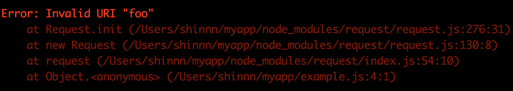

# neat-stack

[](https://www.npmjs.com/package/neat-stack)
[](https://travis-ci.org/shinnn/neat-stack)
[](https://ci.appveyor.com/project/ShinnosukeWatanabe/neat-stack/branch/master)
[](https://coveralls.io/github/shinnn/neat-stack?branch=master)

Make a color-coded stack trace from an error

```javascript
const neatStack = require('neat-stack');
const request = require('request');

request('foo', err => console.error(neatStack(err)));
```



Useful for CLI applications — stack traces are not very important for end users but needed for authors to receive meaningful bug reports.

## Installation

[Use npm.](https://docs.npmjs.com/cli/install)

```
npm install neat-stack
```

## API

```javascript
const neatStack = require('neat-stack');
```

### neatStack(*error*)

*error*: `Error`  
Return: `string`

It returns a refined [`Error#stack`](https://developer.mozilla.org/docs/Web/JavaScript/Reference/Global_Objects/Error/Stack):

* Red-colored by [ANSI escape code](https://en.wikipedia.org/wiki/ANSI_escape_code).
* Lines starting with `'    at'` are dimmed.
* [Any lines from Node.js internals are omitted](https://github.com/sindresorhus/clean-stack).

```javascript
const error = new Error('Hi');

error.stack; /* => `Error: Hi
    at Object.<anonymous> (/Users/example/run.js:1:77)
    at Module._compile (module.js:571:32)
    at Object.Module._extensions..js (module.js:580:10)
    at Module.load (module.js:488:32)
    at tryModuleLoad (module.js:447:12)
    at Function.Module._load (module.js:439:3)
    at Module.runMain (module.js:605:10)
    at run (bootstrap_node.js:423:7)
    at startup (bootstrap_node.js:147:9)
    at bootstrap_node.js:538:3` */

neatStack(error); /* => `\u001b[31mError: Hi\u001b[2m
    at Object.<anonymous> (/Users/example/run.js:1:77)\u001b[22m\u001b[39m` */
```

## License

[Creative Commons Zero v1.0 Universal](https://creativecommons.org/publicdomain/zero/1.0/deed)
